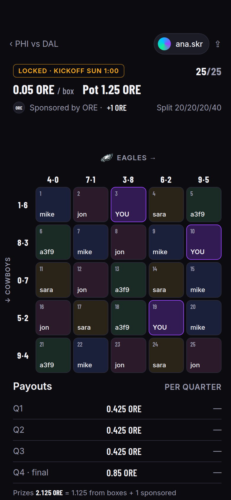
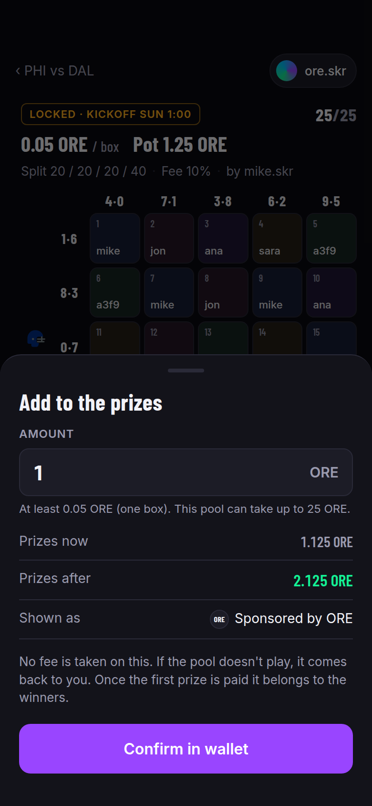
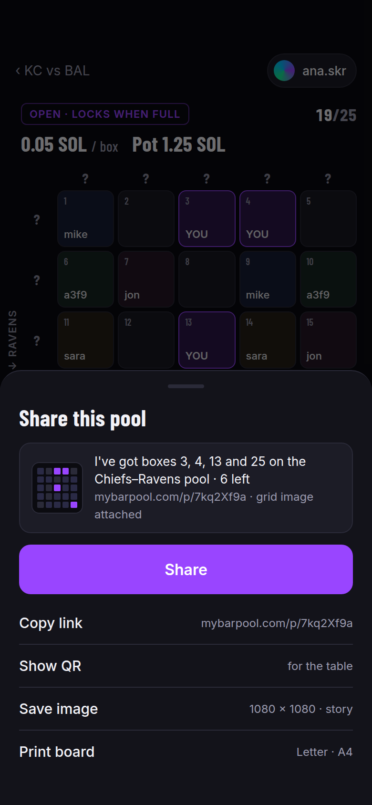

# MyBarPool Design

Product design for the web app and Seeker app. Everything here is mapped before any UI is built. Rules and mechanics live in [ARCHITECTURE.md](ARCHITECTURE.md); this doc covers how it looks and how it flows.

## 1. Brand

### Logo
- The mark is the helmet: the same generic football-helmet silhouette the app draws for every team (the `TeamChip` of section 9), in the brand colors — shell `purple` (`#9945FF`), facemask and ear hole `green` (`#14F195`). The one shape that identifies a team in the product also identifies the product. Decided 2026-10-08, replacing the neon script sign (see the ARCHITECTURE.md decisions log).
- Asset: [brand/helmet-mark.svg](brand/helmet-mark.svg) is the mark, a 24-unit viewBox with the colors baked in; it is the `TeamChip` path verbatim, so the app ships no separate logo file. [brand/helmet-mark-1024.png](brand/helmet-mark-1024.png) is the mark on `bg-0` at 1024×1024, sized for a circular crop, for profile pictures and store listings. Both are generated, not drawn by hand: `scripts/helmet.py` holds the path once and draws it in the brand colors, in any team's colors (`--team KC`, `--all-teams`, a `--sheet` of all 32), in any two colors, unlit, with the wordmark, at any size, on any background, as SVG or PNG. New brand or team artwork comes from it, never from a copy of the path.
- Lockups: mark alone (favicon, app icon, profile pictures, loading state, the corner of the saved image); mark beside the wordmark "My Bar Pool" set in the display face, `text-1`, for the header and link previews. No script face, no glow, no gradient: the mark is two flat colors and reads at 16 px.
- The "off" state: the mark in `line` grey (both colors) is the loading skeleton and empty-state illustration. A pool going Live "lights the helmet".

### Palette
Dark by default. Bars are dark, sportsbooks are dark, and the mark's purple and green carry on dark.

| Token | Hex | Use |
|---|---|---|
| `bg-0` | `#0B0B10` | App background |
| `bg-1` | `#13131A` | Cards, sheets |
| `bg-2` | `#1C1C26` | Elevated surfaces, inputs |
| `line` | `#2A2A38` | Hairlines, grid lines |
| `text-1` | `#F2F2F7` | Primary text |
| `text-2` | `#9A9AAE` | Secondary text |
| `purple` | `#9945FF` | Brand, links, focus rings |
| `green` | `#14F195` | Money in, wins, confirmed |
| `teal` | `#00C2FF` | Live indicators, provisional "leading" (border and text) |
| `amber` | `#FFB020` | Locked, waiting, attention; the leading star on the grid |
| `red` | `#FF4D6D` | Errors, returned pools |

Team colors (each team's primary and secondary) are used only inside team chips and the grid axes, never as page chrome, so the app stays consistent across games. They are the only team-specific thing the app draws: no league or club artwork anywhere (section 9).

### Type
- Display and numerals: a condensed grotesk with tabular figures (scores, prices, payouts must line up). Candidates: Barlow Condensed, Oswald.
- Body: a neutral humanist sans, 15–16px base on mobile. Candidates: Inter Tight, IBM Plex Sans.
- No script or display-decorative faces anywhere; the wordmark is the display face.
- Numbers are the product. Scores, prices and payouts get the largest type on every screen.

### Voice
Short, bar-side, no crypto jargon. "Buy 3 boxes" not "Mint 3 positions". "Sent to your wallet" not "Claim disbursed". Show token amounts with symbol and a USD hint in `text-2`.

The pitch is a weekly habit, not a once-a-year party. Most people know boxes from Super Bowl Sunday; the copy and the home screen make it obvious there's a grid for every game, every week. "Every game. Every week." is the line, and the week selector is the first thing on the home screen.

The unit is a **box**, in every string the user sees and in every identifier in the code, and the game's other common name is not used (see ARCHITECTURE.md, Grid). Grid cells are boxes; the 5×5 as a whole is the grid or the board.

## 2. Design principles

1. **Numbers first.** The grid, the score, the pot. Everything else is secondary chrome.
2. **One primary action per screen.** Game list: pick a game. Game: pick a pool. Pool: buy. Nothing competes with it.
3. **Casino-sportsbook density, not SaaS whitespace.** Cards are tight, information-rich, and stacked. Think a DraftKings game card, not a landing page hero.
4. **Live means live.** Anything real-time pulses in `teal`. Anything settled is `green` with a checkmark and a transaction link. The two never share a color.
5. **Provisional is labelled.** A box that would win at the current score is marked leading: a dotted teal border and a gold star (`amber`) in its corner, which moves to a different box whenever the score changes. The word "Leading" appears in the payouts table beside the same star, never inside the box, where it doesn't fit. A paid box is "Won", green, solid, with a checkmark. A star never means paid and a checkmark never means provisional. This is a hard rule (see ARCHITECTURE.md, live scores vs. results).
6. **Wallet is invisible until needed.** Browse everything without connecting. The connect prompt appears only when tapping Buy or Create.
7. **Built by hand.** See section 8 for what to avoid.

## 3. Information architecture

```
/                       Games (this week)                 <- home
/games/{gameId}         Game: pools on this game
/pools/{poolId}         Pool: grid, buy, results, txs
/create                 Create a pool (3 steps)
/me                     My boxes, my pools, history
/pools/{poolId}/verify  On-chain record (public, linkable)
/p/{code}               Short share link -> /pools/{poolId} (section 4.8)
```

Bottom tab bar on mobile: **Games · My Boxes · Create**. Wallet lives in the top-right as a chip (avatar or .skr name), not a tab.

## 4. Screens

### Rendered mockups
High-fidelity mockups of the screens below are built in HTML/CSS with the real palette and type, at [mockups/screens.html](mockups/screens.html), and rendered to PNG at 390×844 (2×) in [mockups/png/](mockups/png/). Open the HTML in a browser to see all frames side by side, or add `?screen=<id>` (`games`, `game`, `pool-open`, `pool-live`, `buy`, `bought`, `create`, `me`, `pool-sponsored`, `sponsor`, `share`) to view one at phone size. Teams in the mockup are drawn as the section 9 team chip (one inline helmet SVG colored from the team table), the same way production draws them; no league or club artwork appears in the mockups or the app.

All eleven frames side by side: [overview.png](mockups/png/overview.png) (wide; open it at full size rather than inline).

<table>
<tr><td align="center"><br><sub>1 · Games (home)</sub></td><td align="center"><br><sub>2 · Game</sub></td></tr>
<tr><td align="center"><br><sub>3 · Pool, open</sub></td><td align="center"><br><sub>4 · Pool, live</sub></td></tr>
<tr><td align="center"><br><sub>5 · Buy sheet</sub></td><td align="center"><br><sub>6 · Buy result</sub></td></tr>
<tr><td align="center"><br><sub>7 · Create, step 2</sub></td><td align="center"><br><sub>8 · My Boxes</sub></td></tr>
<tr><td align="center"><br><sub>9 · Pool, sponsored</sub></td><td align="center"><br><sub>10 · Sponsor sheet</sub></td></tr>
<tr><td align="center"><br><sub>11 · Share sheet</sub></td><td></td></tr>
</table>

To re-render after editing the HTML:

```bash
cd docs/mockups
for s in games game pool-open pool-live buy bought create me pool-sponsored sponsor share; do
  chrome --headless=new --hide-scrollbars --force-device-scale-factor=2 --window-size=390,844 \
    --virtual-time-budget=8000 --screenshot=png/$s.png "file://$PWD/screens.html?screen=$s"
done
chrome --headless=new --hide-scrollbars --window-size=4690,930 --virtual-time-budget=8000 \
  --screenshot=png/overview.png "file://$PWD/screens.html"
```

The overview is 11 frames × 390 px plus gaps and padding; widen it by 422 px per frame added.

### Wireframes
Wireframes are mobile (390px) since that is the primary target. Desktop is the same content in a two-column layout: list on the left, detail on the right.

### 4.1 Games (home)

```
┌──────────────────────────────────────┐
│ [helmet] My Bar Pool       [◎ wallet]│
│                                      │
│ Week 4 ▾            ● 3 live         │
│──────────────────────────────────────│
│ ┌──────────────────────────────────┐ │
│ │ ● LIVE  Q2 4:12                  │ │
│ │ KC  Chiefs        14             │ │
│ │ BAL Ravens        10             │ │
│ │ 6 pools · 2 open · 38.2 SOL pots │ │
│ └──────────────────────────────────┘ │
│ ┌──────────────────────────────────┐ │
│ │ Sun 1:00 PM                      │ │
│ │ PHI Eagles                       │ │
│ │ DAL Cowboys                      │ │
│ │ 3 pools · 3 open                 │ │
│ └──────────────────────────────────┘ │
│ ┌──────────────────────────────────┐ │
│ │ Sun 4:25 PM                      │ │
│ │ SEA Seahawks                     │ │
│ │ SF  49ers                        │ │
│ │ No pools yet · Create one →      │ │
│ └──────────────────────────────────┘ │
│              ...                     │
│──────────────────────────────────────│
│  [Games]    [My Boxes]   [Create]    │
└──────────────────────────────────────┘
```

- Sorted: live games first, then by kickoff. Finished games drop to the bottom, collapsed.
- Week selector defaults to the current NFL week and covers the whole season: Weeks 1–18, then Wild Card, Divisional, Conference Championships and the Super Bowl. Every game on the schedule gets a page, Thursday night through Monday night, so the home screen has something to play every week from September to February. The Super Bowl is the biggest boxes day of the year and gets the same screen as a Week 4 Sunday afternoon game, not a special mode.
- Between weeks (Tuesday and Wednesday), the selector already shows the coming week with kickoff times, so creators can open pools days ahead and share them at the bar.
- Game card shows the team chip (helmet in team colors) with the team name, score if live, kickoff if not, and a one-line pool summary. Tapping anywhere opens the game.
- The "in pots" figure is boxes sold × price summed across the game's pools, not the sum of full pots — that is why it isn't a multiple of 25 × price.
- Live score on the card comes from the scores service and pulses on change.

### 4.2 Game

```
┌──────────────────────────────────────┐
│ ‹ Week 4                    [◎]      │
│                                      │
│  KC Chiefs   14   ● Q2 4:12          │
│  BAL Ravens  10   Arrowhead · CBS    │
│  Q1 7-3 · Q2 7-7                     │  <- line score, tabular
│──────────────────────────────────────│
│ Pools on this game        [+ Create] │
│                                      │
│ ┌──────────────────────────────────┐ │
│ │ OPEN  0.05 SOL/box  ▓▓▓▓▓░░ 13/25 │ │
│ │ Pot 1.25 SOL · 20/20/20/40       │ │
│ │ Fee 10% · by mike.skr            │ │
│ └──────────────────────────────────┘ │
│ ┌──────────────────────────────────┐ │
│ │ LIVE   1.00 SOL/box   25/25      │ │
│ │ Pot 25 SOL · 20/20/20/40         │ │
│ │ Fee 12% · by bigmikes.skr          │ │
│ │ Q1 won by a3f9 · 4.4 SOL         │ │
│ └──────────────────────────────────┘ │
│ ┌──────────────────────────────────┐ │
│ │ OPEN  0.05 ORE/box  ▓▓░░░░░ 6/25  │ │
│ │ Pot 1.25 ORE · 25/25/25/25       │ │
│ │ Fee 15% · by sara.skr              │ │
│ └──────────────────────────────────┘ │
└──────────────────────────────────────┘
```

- Pool card: status pill, price, fill bar with count, pot, split, total fee (10% plus any add-on, shown as one number), creator. Every card shows the fee and the creator without exception. Live pools show the latest result line. A sponsored pool adds one line under the pot, "Sponsored by ORE · +1 ORE", with the sponsor's small logo when the sponsor is in the directory (ARCHITECTURE.md, Sponsorship); the pot figure itself stays boxes only, so "Pot" always means the same thing.
- Team order is home team first everywhere: cards, headers, the create list ("PHI – DAL" means Philadelphia is home).
- Status pills: `OPEN` purple outline · `LOCKED` amber · `LIVE` teal pulse · `SETTLED` green · `RETURNED` red outline · `SPLIT` amber outline (suspended game, prizes split). An abandoned pool (unresolved 30 days after the scheduled kickoff) shows `RETURNED` styling with a "Reclaim your share" button in place of the buy bar; it is the only button in the app that sends a transaction the platform didn't initiate.
- Sort: open pools first (most filled first, they lock soonest), then live, then settled.
- Filters (chips): token, price range. Only shown when a game has more than 5 pools.

### 4.3 Pool

The most important screen. Three zones stacked: header, grid, details. The buy button is sticky at the bottom while the pool is open.

```
┌──────────────────────────────────────┐
│ ‹ KC vs BAL                 [◎] [⇪] │
│                                      │
│ OPEN · locks when full   13/25 ▓▓▓▓░ │
│ 0.05 SOL / box · Pot 1.25 SOL        │
│ Split 20 / 20 / 20 / 40 · Fee 10%    │
│──────────────────────────────────────│
│              KC Chiefs  →            │
│         ?    ?    ?    ?    ?        │  <- digits hidden until draw
│   ?  ┌────┬────┬────┬────┬────┐      │
│   ?  │ 1  │ 2  │ 3  │ 4  │ 5  │      │
│   ?  │mike│    │zoe │zoe │    │      │
│ B ?  ├────┼────┼────┼────┼────┤      │
│ A ?  │ 6  │ 7  │ 8  │ 9  │ 10 │      │
│ L    │ YOU│jon │    │mike│ YOU│      │
│      ├────┼────┼────┼────┼────┤      │
│ ↓    │ 11 │ 12 │ 13 │ 14 │ 15 │      │
│      │    │    │zoe │    │jon │      │
│      ├────┼────┼────┼────┼────┤      │
│      │ 16 │ 17 │ 18 │ 19 │ 20 │      │
│      │jon │    │    │ YOU│    │      │
│      ├────┼────┼────┼────┼────┤      │
│      │ 21 │ 22 │ 23 │ 24 │ 25 │      │
│      │    │mike│    │    │zoe │      │
│      └────┴────┴────┴────┴────┘      │
│                                      │
│ Payouts                              │
│  Q1  0.225 SOL  —                  │
│  Q2  0.225 SOL  —                  │
│  Q3  0.225 SOL  —                  │
│  Q4  0.45 SOL   —                  │
│                                      │
│ Boxes (13)                           │
│  zoe.skr        4 boxes  3,4,13,25   │
│  YOU            3 boxes  6,10,19     │
│  mike.skr       3 boxes  1,9,22      │
│  ...                                 │
│                                      │
│ Activity                             │
│  zoe.skr bought 2 boxes   2m  ↗      │
│  jon bought 1 box        8m  ↗       │
│  Pool created by mike.skr   1h  ↗    │
│──────────────────────────────────────│
│ ┃ [ −  3  + ]   Buy 3 · 0.15 SOL  ┃  │  <- sticky
└──────────────────────────────────────┘
```

Grid rules:
- Boxes numbered 1–25, top-left to bottom-right, number in the corner of each box in `text-2`.
- Owner shown as .skr name, else first 4 chars of the wallet. The connected wallet's boxes say YOU on a purple fill. Multiple boxes by one owner share a subtle owner color (from a fixed 8-color set) so "4 boxes by ana" reads at a glance.
- Axis digits render as `?` until the draw, then flip in with a short animation. Home team across the top, away down the side, each marked by its team chip (helmet and abbreviation, so "KC" over the columns and "BAL" beside the rows), upright, with no arrows: the chip's position says which way its digits read, and the score strip above the grid shows home first. The two axes are shuffled independently on-chain (see ARCHITECTURE.md, Randomness), so the same pair may appear on both a column and a row; the UI shows whatever the program recorded and never re-derives digits itself.
- Live: the leading box gets a dotted teal border and a gold star (★, `amber`, 15px) in the top-right corner, with a soft glow and a slow pulse while the game is live. No text inside the box: at grid size a word collided with the box number. The star moves with every score update and disappears when the quarter pays. Won boxes get a solid green fill with the quarter label (Q1) and a checkmark. A box can be both (won Q1, leading Q3): the Q1 ✓ label shifts left to make room and the star keeps the corner. The payouts table carries the word: "★ Leading · box 7 · jon" on the live quarter's row, in teal with the gold star, so the star is explained on the same screen. On Q4 100% pools there is only the final prize, so the row reads "★ Leading · final" from the current score all game.
- Tapping a box opens a small sheet: owner, digits it covers (after draw), quarters won, transaction links.

Header by status:
- OPEN: fill bar, "locks when full".
- LOCKED: amber, "Drawing numbers…" with the unlit-sign loader; once drawn it reads "Locked · waiting for kickoff" with digits revealed, and flips to LIVE at kickoff.
- LIVE: score strip replaces the fill bar: `KC 14 · BAL 10 · Q2 4:12`, teal pulse on change.
- SETTLED: green, "All quarters paid", total paid out.
- RETURNED: red outline, "Pool didn't fill · your 0.15 SOL was returned ↗".

Payouts table: amount per quarter, then winner + tx link as each one settles. This table is fed only by on-chain events, never by live scores. Quarter amounts are the prize amounts after fees, so the numbers players see add up to what is actually paid.

Fee line: the header shows the total ("Fee 12%" for a pool with a 2% add-on); tapping it, or the pool's details section, shows the breakdown "Platform 5% · Creator 7%" with amounts. Pools created by third-party clients can carry an integrator fee; the MyBarPool app never sets one but must display it when present, as a "Client 2%" line in the same breakdown. To the creator, the same spot reads "You earn 0.0875 SOL with the pool's first prize" and switches to "Earned 0.0875 SOL ↗" once paid.

Activity: purchases, sponsorships, lock, draw, each settlement, returns. The first settlement adds one row alongside the prize: "Fees paid · 0.0625 SOL platform · 0.0875 SOL creator ↗", same transaction link. Every row links to its transaction. This is the "verify on chain" surface; `/pools/{id}/verify` is the same list as a standalone public page.

Sponsorship (ARCHITECTURE.md, Sponsorship). Most pools have none and show nothing. When a pool has been sponsored:
- Header gains one line under the pot: "Sponsored by ORE · +1 ORE", with the sponsor's logo from the directory, or "Sponsored by 7kq2…9a" (.skr name if there is one) for a wallet the directory doesn't know. Several sponsors read "Sponsored by ORE and 2 others". The pot line is unchanged, so "Pot 1.25 ORE" is still boxes only and the sponsored amount is always shown as an addition.
- Tapping the sponsor line opens the sponsor sheet: logo and name large, the amount and its transaction link, then up to two plain buttons from the directory entry: "Visit ore.com ↗" (opens the browser) and, when the sponsor has a Seeker app listed and the dApp Store is present on the device, "Get ORE on the dApp Store" (opens `solanadappstore://details?id=…`; on web or when the store isn't installed the button is simply absent, never a dead tap). With several sponsors the sheet lists each with their own buttons. A sponsor not in the directory gets the sheet with the shortened address and the transaction link only. Links come from the directory and nowhere else, always open outside the app, never carry anything appended, and never appear on the buy path: a player can't reach a sponsor's site from the buy sheet, only from the sponsor line.
- Payouts table shows the full quarter amounts (boxes plus sponsorship, after fees); its footer reads "Prizes 2.1 ORE = 1.1 from boxes + 1 sponsored" so the arithmetic is on the page.
- Activity row: "ORE added 1 ORE to the prizes ↗". On a returned pool: "Returned 1 ORE to ORE ↗".
- The action lives in the details section as a text link, "Add to the prizes", not as a button and never in the buy bar: sponsoring is for a company or a community that has decided to do it, and nothing in the app should read as a nudge for a player to put in more. It opens `SponsorSheet`: amount input in the pool's token (minimum one box price, the per-token cap shown if reached), then three short lines that are always the same: "No fee is taken on this. If the pool doesn't play, it comes back to you. Once the first prize is paid it belongs to the winners." Confirm, sign, result with the transaction link. Hidden once sales have closed.
- Mockup frame 9 shows a sponsored pool (locked, ORE) and frame 10 the `SponsorSheet`; the header line, the payouts footer, the "Sponsored" details row and the activity row are the only visible differences from an unsponsored pool. Frame 11 is the share sheet from section 4.8.

Share (⇪): opens the share sheet described in section 4.8.

### 4.4 Buy flow

Goal: two taps from the pool page to a confirmed purchase for a returning user.

```
 Pool page                 Sheet                          Result
┌───────────┐   ┌──────────────────────────┐   ┌──────────────────────────┐
│ [− 3 +]   │ → │ Buy 3 boxes              │ → │ ✓ You own 3 boxes        │
│ Buy 3 ·   │   │ 3 × 0.05 SOL   0.15 SOL  │   │ 6 · 10 · 19              │
│ 0.15 SOL  │   │ Network fee   ~0.00001   │   │ Positions are random and │
└───────────┘   │ Balance       2.31 SOL   │   │ every box has the        │
                │                          │   │ same odds.               │
                │ Boxes are assigned at    │   │ [View grid]  [Share]     │
                │ random. All 25 have the  │   └──────────────────────────┘
                │ same odds until the draw.│
                │                          │
                │ [ Confirm in wallet ]    │
                └──────────────────────────┘
```

- Not connected: the sheet's button reads "Connect wallet", then continues into the same sheet without losing the count.
- Stepper caps at boxes remaining (or, for the pool's creator, at 5 minus what they already own). If the pool fills between opening the sheet and confirming, the sheet updates in place: "Only 2 left" and adjusts.
- Wrong token balance: inline message with the shortfall, no dead ends.
- After confirm: the sheet shows a spinner over "Confirming…", then the result. The grid behind it animates the new boxes in.
- Never show a raw transaction signature in the primary flow; the ↗ link is enough.

### 4.5 Create flow

Three steps in one sheet with a progress line. Under 60 seconds for a returning user.

```
Step 1 · Game                Step 2 · Setup                Step 3 · Review
┌────────────────────────┐   ┌────────────────────────┐   ┌────────────────────────┐
│ Pick a game            │   │ Token   [SOL][SKR][ORE]│   │ PHI vs DAL · Sun 1:00  │
│ ─────────────          │   │                        │   │                        │
│ Sun 1:00  PHI – DAL  ○ │   │ Price per box          │   │ 0.05 SOL/box · 1.25 pot│
│ Sun 1:00  WAS – NYG  ○ │   │ [ − 0.05 + ] SOL       │   │ Split 20/20/20/40      │
│ Sun 4:25  SEA – SF   ● │   │ Full pot: 1.25 SOL     │   │ Fee 10% · you earn 5%  │
│ Sun 8:20  DET – GB   ○ │   │                        │   │                        │
│ Mon 8:15  MIA – LAR  ○ │   │ Payout split           │   │ Your boxes  [− 1 +]    │
│                        │   │ (●) 20/20/20/40        │   │ 1 × 0.05 SOL           │
│                        │   │ ( ) 25/25/25/25        │   │ Creation fee  0.014 SOL│
│                        │   │ ( ) Q4 100%            │   │ ─────────────          │
│                        │   │                        │   │ Total          0.064   │
│                        │   │ You earn 5% · 0.0625   │   │                        │
│                        │   │ Extra fee     [ 0 ]%   │   │ Pool won't lock until  │
│                        │   │                        │   │ all 25 sell. Unsold at │
│ [Next]                 │   │ [Next]                 │   │ kickoff = full return. │
└────────────────────────┘   └────────────────────────┘   │ [Create pool]          │
                                                          └────────────────────────┘
```

- Step 1 lists this week's games not yet kicked off. Live and finished games aren't offered. A game where the creator already has 3 open pools is shown dimmed with a "3 open" tag and can't be selected.
- Step 2's price is a stepper, not a text field: − / + moves in the token's step (0.05 SOL, 100 SKR, 0.05 ORE) between the token's min and max, so an invalid price can't be typed. Long-press accelerates. "Full pot" recomputes live. At the cap the + button disables with a "Max 1.00 SOL per box" hint.
- Creator earnings are shown plainly in step 2: "You earn 5% of the pot (0.0625 SOL), paid with the pool's first prize", recomputed with the price. The same phrase is used everywhere, because "first prize" is Q1 on most splits and the final on Q4 100%; never hard-code "Q1" into creator copy. Below it, the optional add-on fee (0–5%, default 0), introduced as "on top of your 5%" so nobody thinks they must set it to be paid, with the note that it's added to the fee every buyer sees and comes out of the pot. With an add-on set, the earnings line shows the combined figure ("7% · 0.0875 SOL"). Never say "when the pool fills": nothing is paid at lock.
- Step 3 is the single transaction: the creation fee (account rent, labelled as a fee and never as a refundable deposit) + any boxes the creator wants. Stepper starts at 1 and runs 0–5; at 5 the + button disables with a "Max 5 of your own boxes" hint. The button reads "Create pool" either way.
- On their own pool page, the creator's buy stepper caps at 5 minus the boxes they already hold, with the same hint. Everyone else's caps at boxes remaining.
- Success lands on the new pool page with the share sheet pre-opened, since the creator's next job is to get the rest of the grid sold.
- Later, not v1 app: a "Private" toggle in step 2 creates a link-gated pool (the program supports it from v1, see ARCHITECTURE.md, Private pools). The share sheet then carries the invite link and a printable QR; the pool gets a "Private" pill and is left off the game page. The pool page must handle opening a private pool from its link, including when the user isn't connected yet. `access_type` is fixed at creation: a private pool can't be made public later or the reverse; the creator makes a new pool instead.

### 4.6 My Boxes

```
┌──────────────────────────────────────┐
│ My Boxes                  [◎ ana]    │
│                                      │
│ Active                               │
│ ┌──────────────────────────────────┐ │
│ │ ● LIVE  KC 14 – BAL 10  Q2       │ │
│ │ 3 boxes · 6, 10, 19              │ │
│ │ Leading Q2 ▸ box 10              │ │
│ └──────────────────────────────────┘ │
│ ┌──────────────────────────────────┐ │
│ │ OPEN  PHI – DAL  Sun 1:00        │ │
│ │ 1 box · 14 · 19/25 filled        │ │
│ └──────────────────────────────────┘ │
│                                      │
│ Won                   +1.125 SOL all │
│  Q1 · KC–BAL      0.225 SOL    ↗  │
│  Q4 · SF–SEA      0.90 SOL     ↗  │
│                                      │
│ Pools I created (2)                  │
│ Returned (1)                         │
└──────────────────────────────────────┘
```

- Active first, sorted live → open → locked. Won list is the personal ledger with tx links. Created and returned pools collapse. A wallet that has sponsored a pool gets a "Pools I sponsored" group in the same collapsed style, with the amount and whether it was paid out or returned; it only appears when there is something in it.
- Empty state: the unlit helmet mark, "No boxes yet", one button to Games.

### 4.7 Notifications (Seeker)
- "Your box hit" on each quarter you win: `Q2 · KC–BAL · You won 0.225 SOL`. Tapping opens the pool.
- "Pool locked, numbers drawn" for pools you're in.
- "Pool returned" with the amount.
- Nothing promotional. Notification volume is one of the fastest ways to feel cheap.

### 4.8 Sharing

A creator has to sell 24 more boxes after buying their own, and most of that happens by dropping a link in the bar's group chat. Sharing is therefore a first-class flow, not a button. Every part below is designed so that the person receiving the link sees the actual grid before they've installed anything or connected anything.

**The link**
- One canonical URL per pool: `https://mybarpool.com/pools/{poolAddress}`. It is the same on web and in the app, it is what the SDK and third-party clients link to, and it works with nothing but an RPC: the page reads the pool straight from the chain.
- The app shares a short form, `https://mybarpool.com/p/{code}`, where `code` is the first 8 characters of the pool address. It's readable aloud across a bar and fits in a text. The server resolves it by prefix from the indexer and redirects to the canonical URL; if the server were ever down the canonical link still works, which is why the long form is canonical and the short form is a convenience.
- Game pages share too (`/games/{gameId}`), for "there are three pools on the Eagles game, pick one".
- Android App Links: `assetlinks.json` on mybarpool.com verifies the app, so tapping a link on a Seeker with the app installed opens the pool page in the app. Without the app it opens the web app in the browser. There is never an interstitial "open in app" page and never a custom URL scheme in anything a user sees.
- The web pool page works fully without a wallet: grid, names, price, fee, split, kickoff, activity. Connect is only prompted on Buy (section 2, principle 6).

**The preview**
- Every pool page is server-rendered with Open Graph and Twitter card tags so iMessage, WhatsApp, X, Discord and Telegram show a real preview: title "Eagles vs Cowboys · 0.05 SOL a box · 19/25 sold", description with kickoff, split and total fee (and "Sponsored by ORE · +1 ORE" when a pool is sponsored), and an image of the actual grid with names filled in. The image is the pitch.
- The preview image is rendered server-side per pool, cached, and invalidated on every buy, lock, draw and settlement, so a link tapped an hour later shows the current board. Before the draw the axes show `?`; after it they show digits; live it shows the leading box; settled it shows the winners.
- The same renderer produces the image the share sheet attaches and the printable board, so the preview, the shared image and the sheet on the wall are always the same picture.

**The share sheet**
- Opens from ⇪ on the pool page, from the post-buy result, from the post-create landing (pre-opened, section 4.5), and from the "Pool locked, numbers drawn" notification.
- Pre-filled text, live at share time, not just a URL:
  - Creator: "Grab a box on my Eagles–Cowboys pool · 0.05 SOL a box · 6 left · mybarpool.com/p/7kq2Xf9a"
  - Buyer, after buying: "I've got boxes 2, 12 and 17 on the Eagles–Cowboys pool · 3 left · mybarpool.com/p/7kq2Xf9a"
  - Full or live pool: "Eagles–Cowboys boxes · numbers are drawn · mybarpool.com/p/7kq2Xf9a" (nothing to sell, but people screenshot the board).
- Actions, in this order: **Share** (native sheet on Seeker with the grid image attached; Web Share API in the browser where available, else copy), **Copy link**, **Show QR**, **Save image**, **Print board**.
- Show QR: full screen, high contrast on white, pool URL printed under it in the display face, big enough to scan from across a table. For holding the phone up or pointing a webcam at.
- Save image: the grid graphic at 1080×1080 and 1080×1920 (feed and story), with the helmet mark small in a corner and the short URL along the bottom. No prices in the image beyond what's on the grid header; the image should still make sense a week later.
- Print board: one-tap PDF at US Letter and A4 of the grid with names, the QR in a corner and the URL under it, for bars that still tape a sheet to the wall. Before the draw the axes read "Numbers drawn when the grid sells out"; after it, the digits. Re-print after the draw is the expected pattern.
- Sponsored pools: the saved image, the story image, the printed board and the link preview all carry the sponsor line with the logo ("Sponsored by ORE"), in the same small type as the URL, under the grid header. That is the sponsor's visibility: on the sheet taped to the wall and in the group chat, not a banner in the app. Never the amount in the image, for the same reason there are no prices in it.

**Private pools** (program supports them from v1; app exposes them later, section 4.5)
- The invite link carries the gate key in the URL fragment, `https://mybarpool.com/p/{code}#k={key}`, never in the path or query, so it never reaches server logs, the redirect, or the preview renderer. The web app reads it client-side and signs `buy` with it silently.
- The preview for a private pool shows the game, price and fill count but not the grid or the names.
- Show QR and Print board carry the full invite link; that is how a bar shares a private pool with the room.

**What sharing is not**
- No referral codes, invite rewards or "share to earn". They look cheap, and paying people to recruit players is not what a bar's board is. The creator's 5% is already the reason to share.
- No third-party link shorteners; the short form is ours and resolves to ours.
- No tracking parameters on shared links. The link is the pool address; that is enough analytics.

## 5. Components

| Component | Notes |
|---|---|
| `TeamChip` | A generic football-helmet silhouette in the team's primary color with the facemask and ear hole in the secondary color, beside the abbreviation (grid axes, tight spots, the saved image) or the team name (game cards, headers, score strip). 3 sizes. Drawn from one SVG and the team table, so there is no asset to fail to load and nothing to download. Never a logo, decal, team-specific stripe or any other club artwork. |
| `StatusPill` | OPEN / LOCKED / LIVE / SETTLED / RETURNED / SPLIT, colors per section 4.2. |
| `FillBar` | 25 segments, not a smooth bar, so "19/25" is countable. |
| `ScoreStrip` | Team, score, clock; tabular numerals; pulse on change. |
| `LineScore` | Q1–Q4 (+OT) per team, tabular. |
| `BoxGrid` | The 5×5 with axes; props for digits, owners, leading (gold star + dotted teal border), won (green, Q label, checkmark), highlight-mine. Fully keyboard and screen-reader navigable (each box is a button with a label like "Box 10, owned by you, digits 3 and 7"). |
| `BoxSheet` | Box detail popover. |
| `BuySheet` | Stepper, cost breakdown, wallet state, confirm, result. |
| `CreateSheet` | Three steps. |
| `PayoutTable` | Quarter, amount, winner, tx. |
| `ActivityList` | Rows with tx links. |
| `WalletChip` | Connect / connected with .skr; menu: copy address, disconnect. |
| `ShareSheet` | Pre-filled text, Share / Copy link / Show QR / Save image / Print board; knows whether the caller is the creator, a buyer or a viewer (section 4.8). |
| `GridImage` | The grid rendered as an image (preview, share, story, print). One renderer, run server-side for previews and on-device for the share sheet, from the same component. |
| `SponsorLine` | "Sponsored by …" with logo from the sponsor directory or a shortened address; single or "and N others"; tap opens the sponsor sheet (name, amount, tx, "Visit …" and "Get … on the dApp Store" from the directory; links open outside the app). Used on pool cards, the pool header, the link preview, the saved image and the printed board. |
| `SponsorSheet` | Amount in the pool's token, the three fixed lines about fee, return and commitment, confirm, result (section 4.3). |
| `Logo` | The helmet mark, alone or with the wordmark, lit (brand colors) or unlit (`line`), for header, loading, empty. The mark is the `TeamChip` path with the brand colors fixed. |
| `TokenAmount` | Amount + symbol, optional USD hint. Box prices in the token's natural precision (SKR whole, SOL/ORE two decimals); prizes and fees to at most 4 decimals, rounded half-up for display, exact amount in the transaction and on tap. |

## 6. States and edge cases to design, not improvise

- Pool locks while user is on the page: header morphs OPEN → LOCKED, buy bar slides away, draw animation runs, digits flip in.
- Pool returned while user is on the page: red header, activity row "Returned 0.15 SOL to you ↗".
- Game delayed: LOCKED with "Delayed · waiting for kickoff", no countdown.
- Game postponed or cancelled: the pool is returned like any other; header "Game postponed · your 0.15 SOL was returned ↗" (or "cancelled"). The game page keeps the game with its new date, if any, as a fresh game record, so creators can open new pools on it.
- Overtime: score strip shows `OT`; payouts table's Q4 row reads "Final (incl. OT)".
- Suspended: header "Game suspended · prizes split", payouts rows replaced by a single "Split" row with per-box amount. On a sponsored pool the split includes the sponsorship if a prize had already been paid; if none had, the sponsorship shows as returned to the sponsor in the activity list.
- Sponsored pool returned (unfilled, postponed, cancelled): the sponsor line stays on the header so the record is honest, and the activity list shows "Returned 1 ORE to ORE ↗" next to the buyers' returns. A sponsor viewing their own sponsorship sees "Your 1 ORE was returned ↗" in the same place a buyer sees their return.
- Sponsor wallet not in the directory: shortened address or .skr name, never a blank, never a placeholder logo.
- Sources disagree (keeper paused): show the live score as usual with a small "Verifying…" tag on the payouts table; never show a winner.
- Creator at a limit: "Create pool" on a game where they already have 3 open reads "3 open pools on this game" and is disabled, with a link to those pools. A creator at 5 boxes in their own pool sees the buy bar replaced by "You hold the max 5 boxes in your pool".
- Wallet disconnected mid-buy, transaction rejected, insufficient balance, RPC timeout: each has copy and a recovery action.
- Shared link opened after the pool changed: a full pool shows the grid with "Sold out · numbers drawn" and no buy bar; a returned pool shows the red header and why; a settled pool shows the winners. The link never dead-ends on "pool not available".
- Short link that doesn't resolve (typo, or the indexer is behind): the page says "We can't find that pool" with a search box for the full address, and never a bare 404.
- Link opened with no app and no wallet on the phone: the web page renders fully; Buy explains what a wallet is in one line with a link to install one. Browsing is never blocked.
- Slow network on Seeker: skeletons use the unlit sign; grid renders empty boxes immediately.

## 7. Inspiration and what to take from it

Study, don't copy. Screenshots for the team's reference only; no assets are reused.

- **DraftKings / FanDuel:** dark surfaces, dense game cards, huge tabular numbers, one accent for money. The way a game card shows both teams and a single call-to-action. Take the density and the numeric hierarchy.
- **Kalshi / Polymarket:** clean market cards, price as the hero, calm typography, restrained color. Take the calm; a boxes pool has fewer moving parts than a sportsbook and should feel simpler.
- **Physical boards in bars:** hand-written names in boxes, digits along the edges. Take the literal layout; people already know how to read it.
- **Bar signage, lit and unlit:** for the mark's on/off metaphor only (loading, empty, going Live).

## 8. What "built by a human team" means here

Concrete rules, because "don't look AI-generated" isn't actionable.

- No purple-to-blue gradient backgrounds, no glassmorphism cards, no floating blob shapes. No Solana gradient anywhere: the mark is two flat colors.
- No three-column feature grid with icons. No hero section with a headline and two buttons. The home page is the games list, full stop.
- No emoji in UI copy. No exclamation points.
- No generic illustrations. The only illustration is the helmet mark.
- Real content in every mock: real team names, real scores, realistic wallet names. Never "Lorem ipsum" or "User 1".
- Density over whitespace. If a screen has one card floating in empty space, it's wrong.
- One type family for numbers, one for text. No decorative fonts; the wordmark is the numbers face.
- Motion is functional: score pulse, digit flip, box fill. Nothing bounces, nothing floats, no parallax.
- Every number that comes from the chain links to the chain.

## 9. Asset notes

- No team logos, anywhere: not in the app, the mockups, the saved and printed grids, the link previews or notifications. Teams are identified the way Kalshi and Polymarket identify them: a generic helmet shape in the team's colors, the standard abbreviation (KC, BAL, PHI, DAL, GB, NYJ, NYG, SF, LAR, LAC, LV, WSH, …) and, where there is room and it reads better, the team name in plain text. Team names appear only as text that identifies the game, never styled as a mark. Decided 2026-10-08, replacing the earlier decision to use real logos (see the ARCHITECTURE.md decisions log); the public TRADEMARKS.md says the same.
- The helmet: one SVG silhouette (side view, shell, ear hole, two-bar facemask), filled from the team table, the same file at every size. It must stay generic: no decal on the shell, no stripe or pattern that belongs to a club, no helmet shape that is itself a club's design. The mockup's `#helmet` symbol in `mockups/screens.html` is the reference drawing.
- Team colors (primary and secondary), abbreviations and names come from a static table in `packages/shared`, keyed by the team IDs the scores service uses, so every surface agrees. Nothing is fetched from Kalshi, Polymarket, ESPN or any media host for team display; the scores sources are used for scores only.
- When the pool header or a share image wants something larger than a chip, it is the same helmet at a larger size, never a sourced image.
- Fonts: choose open-licensed families (Google Fonts) so the Seeker build has no font licensing issue.

## 10. Build specification

What the screens above need underneath them, written so the app can be built without guessing. Rules come from [ARCHITECTURE.md](ARCHITECTURE.md); account layouts, events and algorithms from [PROGRAM.md](PROGRAM.md). Where a string is quoted here it is the string; where a number is given it is the number.

### 10.1 Data the app reads

Two kinds, never mixed:

| Kind | Source | Used for | Freshness |
|---|---|---|---|
| Chain state | Pool, game, config and sponsorship accounts via the SDK; program events via the SDK's event subscription (a log subscription on the pool for the signatures, the event bodies read from each transaction's inner instructions, since the program emits with `emit_cpi!`, PROGRAM §7) | Everything with money in it: ownership, status, prizes, fees, results, activity | Account subscription per open pool page; SDK poll every 30 s elsewhere |
| Live state | Scores WebSocket (`game`, `leading`, `pool`, `event` messages) | Scores, clocks, "Leading", fill counts before the account subscription catches up | Push |

The app also reads a public REST listing (schedule, pools per game, wallet views) as a convenience. If it is unavailable the same lists are built from `getProgramAccounts` through the SDK, slower; no screen depends on the REST layer to function, only to be fast.

Results (`won`, payouts, returns) come only from decoded program events or from account state that reflects them. The `leading` message and any locally computed leading box are display-only: dotted teal border, gold star, the word "Leading" only in the payouts table.

### 10.2 Derived states

`PoolStatus` on-chain is `Open, Locked, Drawn, Settled, Returned, Split`. The app derives what it shows:

| Shown | Condition |
|---|---|
| `OPEN` | `Open` |
| `LOCKED` "Drawing numbers…" | `Locked` and not drawn |
| `LOCKED` "Locked · waiting for kickoff" | `Drawn` and `now < recorded_kickoff` |
| `LIVE` | `Drawn` and `now ≥ recorded_kickoff`; the pool leaves `LIVE` through `settle` (→ `Settled`), not through the game's `Final` — a `Drawn` pool whose game is `Final` but whose last quarter is not yet settled is still `LIVE` |
| `SETTLED` | `Settled` |
| `RETURNED` | `Returned` (header copy depends on why: unfilled, postponed, cancelled, cancelled by the team) |
| `SPLIT` | `Split` |
| Abandoned ("Reclaim your share") | any of `Open, Locked, Drawn` and `now ≥ scheduled_kickoff + 30 d`; or `Returned`/`Split` with `abandoned` and the wallet still holding an unreturned box |
| "Delayed" | game live window reached, scores feed says `delayed` |
| "Verifying…" tag on payouts | live feed marked `standby` or the game is halted (no `leading` message for 2 minutes while live) |

"Why returned" comes from the game record status (`Postponed`, `Cancelled`), `cancelled_by_admin`, or neither (unfilled).

### 10.3 Formatting

- Token amounts: `TokenAmount` takes base units and the token index. Box prices in natural precision (SOL/ORE two decimals, SKR whole). Prizes and fees to four decimals, half-up, trailing zeros trimmed to at least two decimals for SOL/ORE ("0.45 SOL", "0.2813 SOL") and none for SKR ("2,250 SKR"). Tap shows the exact base-unit amount. Thousands separators always. The USD hint is optional, in `text-2`, and only when a price feed is available; never in shared images.
- Percentages: integers ("Fee 12%"); the breakdown uses integers too ("Platform 5% · Creator 7%").
- Times: kickoff in the device time zone with zone label on hover/tap ("Sun 1:00 PM"); relative for activity under 24 h ("2m", "1h"); dates beyond that ("Sep 28").
- Scores: tabular numerals; home first everywhere ("KC 14 · BAL 10"); the clock as the feed gives it.
- Wallets: `.skr` name if resolvable, else first 4 characters ("a3f9"); the connected wallet is always "YOU" on the grid and "You" in sentences. `.skr` names are AllDomains names on mainnet and are resolved there whatever cluster the app is on. The app never resolves them itself: it asks the scores service for a batch (`GET /v1/names?addresses=…`, reverse lookup, sorted so the label is stable, cached for an hour with misses cached too), so a grid of 25 owners is one request, not 25 RPC calls from a phone, and no RPC key ships in the APK. A name that fails to resolve degrades to the short address, never to a blank or a spinner. Names are labels, never payees: nothing in the app resolves a `.skr` forward to send money anywhere.
- Box labels: 1–25, from `packages/shared` only. No file in `apps/app` adds 1 to an index.

### 10.4 Wallet and transactions

- Client library: `@solana/kit` throughout; no `@solana/web3.js` anywhere in `apps/app` or `packages/shared` (the two stacks have different provider props, hook returns and transaction types, and Solana Mobile's own skills refuse to mix them). Query keys for chain data include the cluster id.
- Android: Mobile Wallet Adapter through `@wallet-ui/react-native-kit`: `MobileWalletProvider` at the root with `createSolanaMainnet({ url })` and the app identity (name, icon, `uri: https://mybarpool.com` — wallets show it during authorization, so it must be the real domain), `QueryClientProvider` above it, and `useMobileWallet()` inside the abstraction below. Connect opens the wallet picker once; the provider caches the authorization token and reauthorizes silently, falling back to a fresh `authorize` if that fails. Seed Vault appears as a wallet like any other. Known edges: the hook has no `connected` boolean (derive from `account`); `signAndSendTransaction` takes `minContextSlot` as its second argument (or use `sendTransactions(instructions)`); the hook exposes `client`, not `connection`. Requires a development build (`expo run:android`); Expo Go is not supported.
- Web: Kit's wallet plugin (`@solana/kit-plugin-wallet`) with `@solana/react` and `@wallet-standard/react`, the stack in Solana Mobile's `react-kit-shadcn` web template; Phantom, Solflare and Backpack tested, anything wallet-standard accepted. Two wallets are registered at startup before discovery runs: `@solana-mobile/wallet-standard-mobile` (Mobile Wallet Adapter as a wallet-standard wallet, so an Android browser without an extension still gets a wallet) and Seeker Connect (`@solana-mobile/seeker-connect-wallet-standard`, `registerSeekerConnect({ identity, relayDomain })`) with the same app identity, so it appears as the wallet "Seeker Connect" in the same list and connects a Seeker's built-in wallet from the phone's browser or, through Solana Mobile's relay, from a desktop. "Connected" is a cached authorization token, not a live transport: each sign runs in its own short session and reauthorizes silently, so the user is not re-prompted. On a device where Seeker Connect can't complete (no Seeker, relay unreachable) its own error dialog explains why; the other wallets are unaffected.
- Both behind one `useWallet()` that exposes `address`, `connect`, `disconnect`, `signAndSend(instructions)`. Screens never import either adapter.
- Every transaction: built by the SDK, simulated first (surface the program error name if simulation fails, before the wallet opens), then `signAndSend`, then confirmed at `confirmed`, then the affected accounts are re-read. Transaction version follows the wallet: the SDK builds `v1` when the wallet's `solana:signAndSendTransaction` feature lists `1` in `supportedTransactionVersions` and `legacy` otherwise (Backpack signs v1 since 2026-10-02; Phantom and Solflare had not announced it when this was written, and a version a wallet cannot sign is a failure or a warning in that wallet, never a prompt). Every user transaction is one signer and one program instruction and fits a legacy 1,232-byte packet; the SDK asserts the serialized size against the chosen format before the wallet opens, and the deepest allowlist proof a legacy packet carries was measured by the SDK's lifecycle at Step 9 — 21 hashes, 1,206 bytes; 22 would be 1,238 — and is re-checked at 12c (2²¹ wallets is far above any real list). On `legacy` the compute-unit and loaded-accounts-data-size limits travel as ComputeBudget instructions instead of the v1 transaction config, same numbers; the priority fee does not port as a number — v1 carries a total in lamports (`setTransactionMessagePriorityFeeLamports`, v1-only in Kit), legacy a price in micro-lamports per compute unit (`setTransactionMessageComputeUnitPrice`, legacy/v0-only) — so the SDK converts between them (price × compute-unit limit, rounded up) and the displayed fee is the same either way. The keeper signs with its own key and stays on v1. Priority fee: a small fixed micro-lamport price adjusted by the recent-fee API, capped; shown as "Network fee ~0.00001 SOL" and never itemised further. The compute-unit limit is the simulated usage plus 20% headroom plus 30,000 units for instructions the wallet may append (Seed Vault Wallet adds Lighthouse assertions), so a wallet-modified transaction never fails on budget. The loaded-accounts-data-size limit on a v1 transaction gets the same treatment — simulated size plus the account the instruction may create (a `Sponsorship`, a token account) plus headroom — because Kit's executor pads compute units only and writes the data size exactly as simulated.
- Network pinning: the app authorizes for `solana:mainnet` only (the cluster in `MobileWalletProvider` and in the wallet-standard chain filter). A wallet set to another network is refused by the wallet itself; the app shows "Your wallet is set to a different network. Switch it to Solana mainnet and try again" rather than the wallet's message. Development builds point the same setting at the localnet; there is never a devnet build.
- Buy and create include the SlotHashes sysvar and the creator's override slot (PROGRAM §3.6: always passed, seeded from the pool's creator — on a buy it is the creator's, not the buyer's, since the limit it lifts is the creator's own-box limit; the program ignores it when the account does not exist). SPL pools include the buyer's ATA; if it doesn't exist the buy fails before the wallet opens with "You don't have any SKR in this wallet yet".
- Error mapping, program error name → copy (the full list is in PROGRAM.md §8; these are the ones a user can reach):
  - `SalesClosed` → "Sales closed at kickoff"
  - `NothingToBuy` / `TooManyBoxes` → "Only N left" (recomputed from the fresh pool)
  - `OwnBoxLimit` → "You hold the max 5 boxes in your pool"
  - `OpenPoolLimit` → "3 open pools on this game"
  - `PriceOffLadder` → never shown (the stepper makes it impossible); logged
  - `Paused` → "MyBarPool is paused for maintenance. Nothing has moved; try again shortly"
  - `SponsorshipTooSmall` / `SponsorshipCapExceeded` → "At least 0.05 SOL" / "This pool can take up to N more"
  - `ReclaimTooEarly` → not reachable (button hidden before the date); logged
  - wallet rejection → "Cancelled in wallet" with a retry
  - insufficient lamports/tokens → "You need 0.15 SOL and have 0.12" (exact shortfall)
  - token pool, enough of the token but no SOL for the network fee → "You have the SKR, but this wallet needs a little SOL (about 0.00001) to pay the network fee" — checked before the wallet opens, since the wallet's own message for this case is unreadable
  - RPC timeout after send → "Still confirming…" with the explorer link; the app keeps polling the signature for 90 s, then "We couldn't confirm this yet. Check the link before trying again", never a second automatic send.
  - Blockhash expired (the wallet returns a `BlockhashNotFound`-class error, or confirmation reports the block height passed with no signature seen) → the transaction was never processed; the app rebuilds it with a fresh blockhash and re-opens the wallet once with "That took a little long — please approve again". Mainnet slots are 200 ms from epoch 1052 (October 2026), so a blockhash lives about 30 seconds, not a minute: the blockhash is fetched after simulation and immediately before the wallet opens, never earlier, and a user who leaves the wallet open for a while will see this path. The 90-second polling above ends early once the block height has passed, which is what makes "never a second automatic send" safe.
- Idempotence in the UI: the Confirm button disables from tap until confirmation or failure; a sheet that loses its network connection mid-flight keeps the signature and resumes polling when it returns.

### 10.5 Live connection

- One WebSocket for the app, opened on the first live screen, closed after 60 s in background. Subscribes to the games on the visible week and the pool on the open pool page; unsubscribes on navigation.
- Reconnect with backoff (1 s → 30 s). While disconnected for more than 10 s on a live screen, a thin amber bar "Reconnecting…" at the top; scores freeze in place and the pulse stops. Never show a stale score with a live pulse.
- `leading` messages update the grid highlight; a leading box that disappears (score changed) loses the tag on the next message. If no `leading` message arrives for a live pool for 2 minutes, the tag is cleared and the payouts table shows "Verifying…".
- Fill counts on the game page update from `pool` messages; the pool page trusts the account subscription over the socket when they disagree, since the account is the truth.

### 10.6 Notifications (Android)

- Firebase Cloud Messaging, registered after the first Connect (not on install), token posted to the notifications service with the wallet address; re-posted on wallet change. The service subscribes each wallet to the events that matter to it from the indexer.
- Payloads (title / body / deep link):
  - Won: "Q2 · KC–BAL" / "You won 0.225 SOL" / `mybarpool.com/pools/{address}`
  - Locked: "Pool locked" / "Numbers are drawn on the KC–BAL pool" / pool link
  - Returned: "Pool returned" / "Your 0.15 SOL is back in your wallet" (reason appended for postponed/cancelled) / pool link
  - Split: "Game suspended" / "Prizes were split · you received 0.044 SOL" / pool link
  - Sponsor (to the sponsor only): "Your 1 ORE was returned" or "Your sponsorship was paid out" / pool link
- No marketing, no "pools are filling up", no weekly digests. One channel, default importance, no sound override.
- Tapping opens the pool page in the app through the App Link; if the app was uninstalled the link opens the web page.

### 10.7 Links and routing

- Routes as in section 3. Every route renders without a wallet. `/p/{code}` is handled server-side; the app never resolves short codes itself.
- App Links: `assetlinks.json` served at the well-known path with the release signing certificate's SHA-256; `intent-filter` with `autoVerify` for `https://mybarpool.com/pools/*`, `/games/*`, `/p/*`.
- Fragment handling: on web, `#k=` is read into memory, removed from the address bar with `history.replaceState`, and never sent anywhere. On Android the App Link delivers the full URL to the app, which does the same.
- Outbound links (explorer, sponsor site, dApp Store) open externally with `Linking.openURL`, after `canOpenURL` for custom schemes. Explorer defaults to Solscan with the signature; the choice is a setting.

### 10.8 Screen data contracts

| Screen | Needs | From |
|---|---|---|
| Games | schedule for week; per game: status, score, clock, pool counts, "in pots" sum | REST schedule + live socket; fallback SDK `listGames(week)` + `listPoolsForGame` |
| Game | game record, line score, live state, pools (decoded), sponsor resolution | SDK `getGame`, `listPoolsForGame`; socket `game`, `pool`; directory |
| Pool | pool account (subscribed), game record, events history, sponsors, live state, leading, owner labels | SDK `getPool` + subscription, `getEvents(pool)`, `listSponsors`; socket; REST `/v1/names` for `.skr` labels (fallback: short address) |
| Buy sheet | pool (fresh), wallet balance in the pool's token, remaining, creator cap | SDK + RPC balance |
| Create | week's games not kicked off, creator's open counts per game, config (ladders, presets, caps, default preset, paused) | SDK `getConfig`, counters via PDA reads |
| My Boxes | wallet's boxes across pools, won ledger, created pools, sponsorships, returns | REST wallet view; fallback `getProgramAccounts` with owner filter is too broad — the SDK provides `listPoolsForWallet` via a memcmp on each of the 25 owner slots, batched |
| Verify page | events with signatures for one pool | SDK `getEvents` |
| Share sheet | pool summary, role of the caller, grid image | local render of `GridImage` |

### 10.9 Grid rendering

- `BoxGrid` is pure: props in, pixels out; no fetching. Props: `axes?: {home: number[]; away: number[]}`, `owners: (string | null)[25]`, `labels: string[25]` (already resolved names), `mine: boolean[25]`, `won: ({quarter, amount} | null)[25]`, `leading?: number`, `ownerColors: Map<owner, colorIndex>`.
- Axis digits render `?` until `axes` is set; the flip animation runs once when it changes from undefined to defined and never again (a re-mount must not replay it: keep a "hasAnimated" ref keyed by pool address).
- Owner colours: the 8-colour set assigned in order of first purchase (event order), stable for the pool's life; `mine` overrides with purple.
- Minimum tap target 44 dp per box on phones; the grid is square, width = screen width − 32 dp, axes outside it.
- Leading star: a single `★` glyph in `amber` at 15 px in the box's top-right corner (`position: absolute`), with a 6 px glow and a 2 s opacity pulse between 0.7 and 1 while the game is live; the pulse stops with the live socket. The star is a view with `accessibilityLabel` "Leading at the current score" and `importantForAccessibility: no` on the glyph itself so it isn't read twice. When the same box also has a won label, the label moves left by the star's width; nothing overlaps the box number, ever (the audit measures it at 320 dp width). No text tag is rendered inside a box for leading in any state.
- Accessibility: each box is a button with `accessibilityLabel` "Box 10, owned by you, digits 3 and 7" (or "unsold", or "digits not drawn yet"), with ", leading at the current score" appended for the starred box and ", won Q1" for paid ones; axes are labelled "Home digits 3 and 7 in column 2".
- `GridImage` renders the same component to 1080×1080 and 1080×1920 with the header (teams, price, fill or result), the short URL, and the sponsor line when present; on the server the same code runs in a headless browser.

### 10.10 Copy catalogue

Strings that appear in more than one place live in one file, `apps/app/src/copy.ts`, keyed, so the audit can check them against this document. The fixed ones:

- Fee line: "Fee {total}%"; breakdown "Platform {p}% · Creator {c}%" (+ " · Client {i}%" when set).
- Creator earnings: "You earn {pct}% of the pot ({amount}), paid with the pool's first prize"; after payment "Earned {amount} ↗". Never "Q1", never "when the pool fills".
- Buy sheet note: "Boxes are assigned at random. All 25 have the same odds until the draw."
- Create review note: "Pool won't lock until all 25 sell. Unsold at kickoff = full return."
- Creation fee label: "Creation fee {amount}, covers account rent".
- Returned headers: "Pool didn't fill · your {amount} was returned ↗" / "Game postponed · your {amount} was returned ↗" / "Game cancelled · …" / "Pool cancelled by the team · …".
- Suspended: "Game suspended · prizes split".
- Sponsor: "Sponsored by {name} · +{amount}"; "Sponsored by {name} and {n} others"; "Add to the prizes"; the three lines "No fee is taken on this. If the pool doesn't play, it comes back to you. Once the first prize is paid it belongs to the winners."; activity "{name} added {amount} to the prizes ↗"; "Returned {amount} to {name} ↗".
- Abandoned: "Reclaim your share"; explanation "This pool wasn't settled within 30 days of kickoff. You can take back your {amount} directly from the program."
- Empty states: "No boxes yet" / "No pools yet · Create one →" / "We can't find that pool".
- Paused: as in 10.4.
- Never in any string: the game's other common name, "refund", "deposit", "claim" (as something a player does), "bet", "wager", "gamble", "odds boost", exclamation marks, emoji.

### 10.11 Configuration and environments

- Build-time config: program ID, config PDA, RPC URL(s) — the Android build and the web build each carry their own provider key, distinct from each other and from the server's, per ARCHITECTURE › Unit economics (RPC keys); the key's exposure in a bundle is accepted and bounded by the provider's per-key limits — scores API base, explorer base, FCM sender ID, and the error-reporting endpoint on the MyBarPool API (crashes and program errors only, no analytics, no third-party SDK). Two profiles: `local` (localnet, file signer for test tooling, fixture scores) and `production`. No `devnet` profile exists.
- Feature flags read from the on-chain config where they are rules (`paused`, `preseason_enabled`, `default_preset`, ladders) and from build config where they are app-only (private pools UI, USD hint).
- Team assets bundled: one helmet SVG, which is also the logo mark with the brand colors; colours, abbreviations and names from `packages/shared`. No other logo files anywhere in the bundle.
- Localisation: English only in v1; all strings still go through the copy file so a second language is a file, not a refactor.

### 10.12 Performance and quality bars

- Cold start to the games list under 2 s on a Seeker with cached schedule; first paint shows skeletons (unlit sign) within 300 ms.
- Pool page renders the grid from cache immediately and reconciles with the subscription; no spinner over the grid, ever.
- Bundle: web initial load under 400 KB gzipped; images lazy.
- Every screen has a Storybook-style story per state in section 6; every component in section 5 has one per variant. The audit checks stories against the mockups.
- No analytics SDK, no ads SDK, no third-party fonts at runtime (bundled), no third-party requests from the app except RPC, the MyBarPool API, FCM and the explorer link the user taps.
