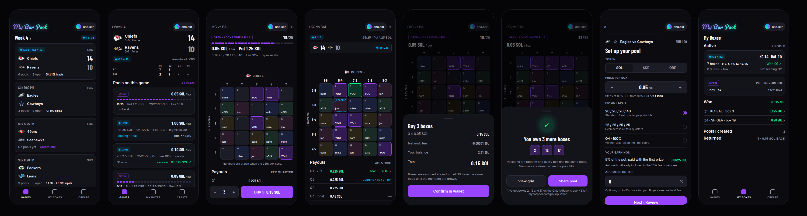
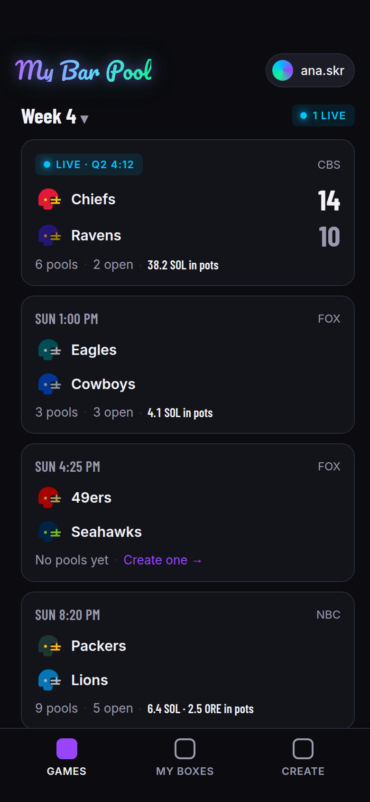
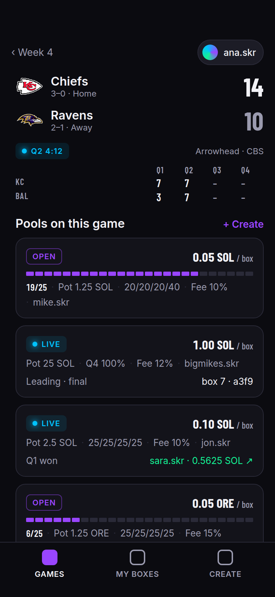
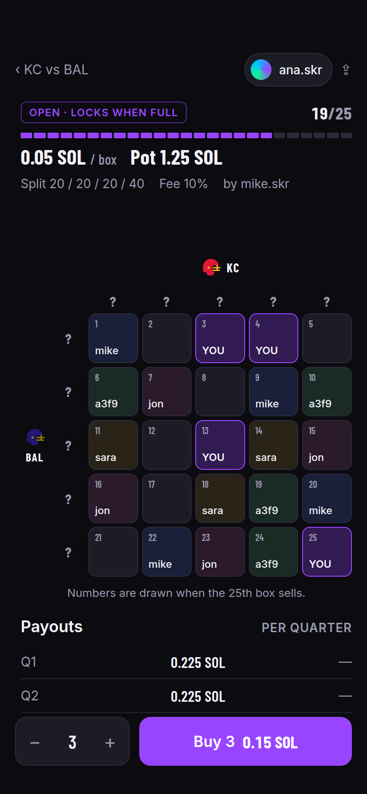
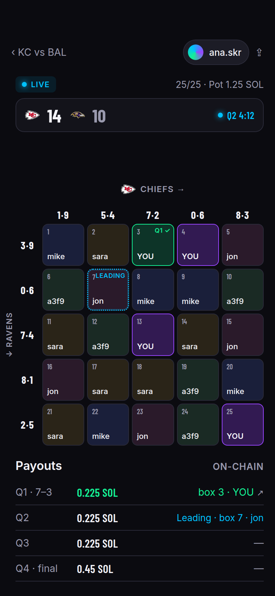
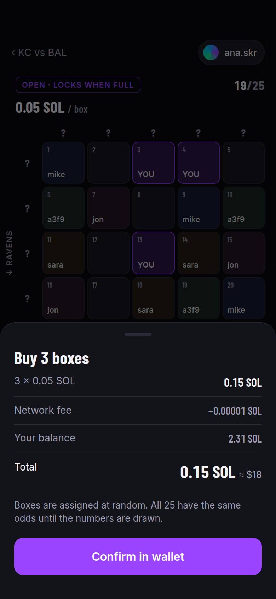
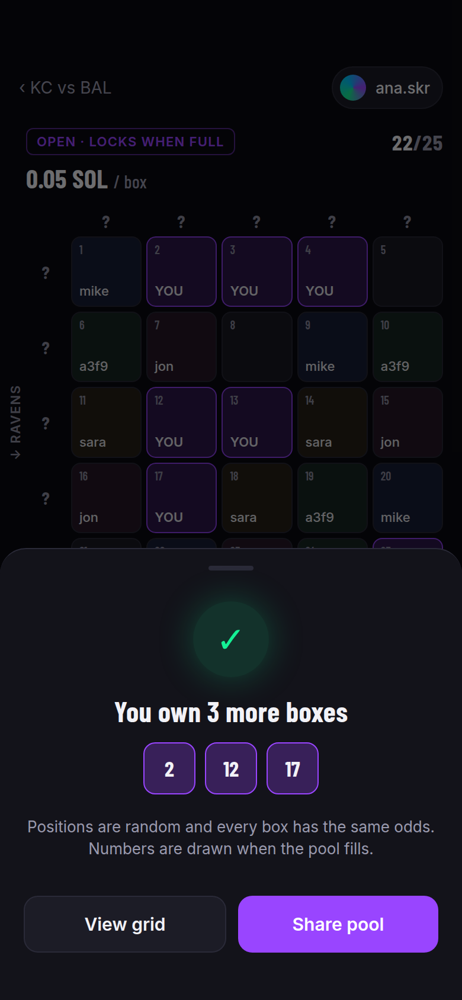
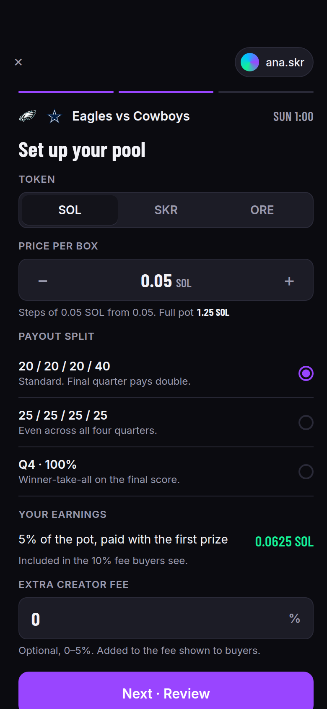
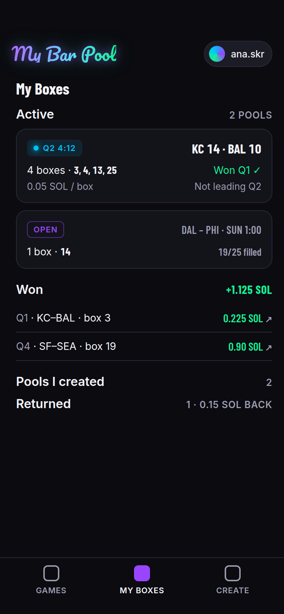

# MyBarPool Design

Product design for the web app and Seeker app. Everything here is mapped before any UI is built. Rules and mechanics live in [ARCHITECTURE.md](ARCHITECTURE.md); this doc covers how it looks and how it flows.

## 1. Brand

### Logo
- Direction: a neon script sign, the kind hung on a brick wall behind a bar. "My Bar Pool" in flowing cursive tube lettering, glowing in a Solana gradient from purple (`#9945FF`) through teal to green (`#14F195`), with a small 5×5 neon grid beneath as the mark.
- Concept reference: [brand/logo-concept-neon.png](brand/logo-concept-neon.png) (generated concept; the grid in it is not 5×5 and is for direction only).
- Production asset: build as SVG, not a raster. Script from a licensed or open script typeface, outlined and converted to paths; glow via SVG filter so it works on any background and at any size. Deliver three lockups: full sign (script + grid), script only (header), grid only (favicon, app icon, loading state).
- The "off" state: the same sign unlit (thin grey tubes) is the loading skeleton and empty-state illustration. A pool going Live "switches the sign on".

### Palette
Dark by default. Bars are dark, sportsbooks are dark, and neon only works on dark.

| Token | Hex | Use |
|---|---|---|
| `bg-0` | `#0B0B10` | App background |
| `bg-1` | `#13131A` | Cards, sheets |
| `bg-2` | `#1C1C26` | Elevated surfaces, inputs |
| `line` | `#2A2A38` | Hairlines, grid lines |
| `text-1` | `#F2F2F7` | Primary text |
| `text-2` | `#9A9AAE` | Secondary text |
| `purple` | `#9945FF` | Brand, links, focus rings |
| `green` | `#14F195` | Money in, wins, confirmed |
| `teal` | `#00C2FF` | Live indicators, provisional "leading" |
| `amber` | `#FFB020` | Locked, waiting, attention |
| `red` | `#FF4D6D` | Errors, returned pools |

Team colors come from the NFL team palette and are used only inside grid axes and team chips, never as page chrome, so the app stays consistent across games.

### Type
- Display and numerals: a condensed grotesk with tabular figures (scores, prices, payouts must line up). Candidates: Barlow Condensed, Oswald.
- Body: a neutral humanist sans, 15–16px base on mobile. Candidates: Inter Tight, IBM Plex Sans.
- Script is reserved for the logo. Never set UI text in script.
- Numbers are the product. Scores, prices and payouts get the largest type on every screen.

### Voice
Short, bar-side, no crypto jargon. "Buy 3 boxes" not "Mint 3 positions". "Sent to your wallet" not "Claim disbursed". Show token amounts with symbol and a USD hint in `text-2`.

The pitch is a weekly habit, not a once-a-year party. Most people know boxes from Super Bowl Sunday; the copy and the home screen make it obvious there's a grid for every game, every week. "Every game. Every week." is the line, and the week selector is the first thing on the home screen.

The unit is a **box**, never a square, in every string the user sees and in every identifier in the code (see ARCHITECTURE.md, Grid). Grid cells are boxes; the 5×5 as a whole is the grid or the board.

## 2. Design principles

1. **Numbers first.** The grid, the score, the pot. Everything else is secondary chrome.
2. **One primary action per screen.** Game list: pick a game. Game: pick a pool. Pool: buy. Nothing competes with it.
3. **Casino-sportsbook density, not SaaS whitespace.** Cards are tight, information-rich, and stacked. Think a DraftKings game card, not a landing page hero.
4. **Live means live.** Anything real-time pulses in `teal`. Anything settled is `green` with a checkmark and a transaction link. The two never share a color.
5. **Provisional is labelled.** A box that would win at the current score is "Leading", in teal, with a dotted border. A paid box is "Won", green, solid. This is a hard rule (see ARCHITECTURE.md, live scores vs. results).
6. **Wallet is invisible until needed.** Browse everything without connecting. The connect prompt appears only when tapping Buy or Create.
7. **Built by hand.** See section 8 for what to avoid.

## 3. Information architecture

```
/                       Games (this week)                 <- home
/games/{gameId}         Game: pools on this game
/pools/{poolId}         Pool: grid, buy, results, txs
/create                 Create a pool (3 steps)
/me                     My boxes, my pools, history
/pools/{poolId}/verify  On-chain record (public, linkable)
```

Bottom tab bar on mobile: **Games · My Boxes · Create**. Wallet lives in the top-right as a chip (avatar or .skr name), not a tab.

## 4. Screens

### Rendered mockups
High-fidelity mockups of the screens below are built in HTML/CSS with the real palette and type, at [mockups/screens.html](mockups/screens.html), and rendered to PNG at 390×844 (2×) in [mockups/png/](mockups/png/). Open the HTML in a browser to see all frames side by side, or add `?screen=<id>` (`games`, `game`, `pool-open`, `pool-live`, `buy`, `bought`, `create`, `me`) to view one at phone size. Team logos in the mockup are hot-linked from ESPN's CDN for preview only; production uses self-hosted assets (section 9).



| | | |
|---|---|---|
|  |  |  |
|  |  |  |
|  |  | |

To re-render after editing the HTML:

```bash
cd docs/mockups
for s in games game pool-open pool-live buy bought create me; do
  chrome --headless=new --hide-scrollbars --force-device-scale-factor=2 --window-size=390,844 \
    --virtual-time-budget=8000 --screenshot=png/$s.png "file://$PWD/screens.html?screen=$s"
done
```

### Wireframes
Wireframes are mobile (390px) since that is the primary target. Desktop is the same content in a two-column layout: list on the left, detail on the right.

### 4.1 Games (home)

```
┌──────────────────────────────────────┐
│ [script logo]              [◎ wallet]│
│                                      │
│ Week 4 ▾            ● 3 live         │
│──────────────────────────────────────│
│ ┌──────────────────────────────────┐ │
│ │ ● LIVE  Q2 4:12                  │ │
│ │ KC  Chiefs        14             │ │
│ │ BAL Ravens        10             │ │
│ │ 6 pools · 2 open · 38.2 SOL pots │ │
│ └──────────────────────────────────┘ │
│ ┌──────────────────────────────────┐ │
│ │ Sun 1:00 PM                      │ │
│ │ PHI Eagles                       │ │
│ │ DAL Cowboys                      │ │
│ │ 3 pools · 3 open                 │ │
│ └──────────────────────────────────┘ │
│ ┌──────────────────────────────────┐ │
│ │ Sun 4:25 PM                      │ │
│ │ SEA Seahawks                     │ │
│ │ SF  49ers                        │ │
│ │ No pools yet · Create one →      │ │
│ └──────────────────────────────────┘ │
│              ...                     │
│──────────────────────────────────────│
│  [Games]    [My Boxes]   [Create]    │
└──────────────────────────────────────┘
```

- Sorted: live games first, then by kickoff. Finished games drop to the bottom, collapsed.
- Week selector defaults to the current NFL week and covers the whole season: Weeks 1–18, then Wild Card, Divisional, Conference Championships and the Super Bowl. Every game on the schedule gets a page, Thursday night through Monday night, so the home screen has something to play every week from September to February. The Super Bowl is the biggest boxes day of the year and gets the same screen as a Week 4 Sunday afternoon game, not a special mode.
- Between weeks (Tuesday and Wednesday), the selector already shows the coming week with kickoff times, so creators can open pools days ahead and share them at the bar.
- Game card shows team chip (logo or abbreviation on team color), score if live, kickoff if not, and a one-line pool summary. Tapping anywhere opens the game.
- The "in pots" figure is boxes sold × price summed across the game's pools, not the sum of full pots — that is why it isn't a multiple of 25 × price.
- Live score on the card comes from the scores service and pulses on change.

### 4.2 Game

```
┌──────────────────────────────────────┐
│ ‹ Week 4                    [◎]      │
│                                      │
│  KC Chiefs   14   ● Q2 4:12          │
│  BAL Ravens  10   Arrowhead · CBS    │
│  Q1 7-3 · Q2 7-7                     │  <- line score, tabular
│──────────────────────────────────────│
│ Pools on this game        [+ Create] │
│                                      │
│ ┌──────────────────────────────────┐ │
│ │ OPEN  0.05 SOL/box  ▓▓▓▓▓░░ 13/25 │ │
│ │ Pot 1.25 SOL · 20/20/20/40       │ │
│ │ Fee 10% · by mike.skr            │ │
│ └──────────────────────────────────┘ │
│ ┌──────────────────────────────────┐ │
│ │ LIVE   1.00 SOL/box   25/25      │ │
│ │ Pot 25 SOL · 20/20/20/40         │ │
│ │ Fee 12% · by bigmikes.skr          │ │
│ │ Q1 won by a3f9 · 4.5 SOL         │ │
│ └──────────────────────────────────┘ │
│ ┌──────────────────────────────────┐ │
│ │ OPEN  0.05 ORE/box  ▓▓░░░░░ 6/25  │ │
│ │ Pot 1.25 ORE · 25/25/25/25       │ │
│ │ Fee 15% · by sara.skr              │ │
│ └──────────────────────────────────┘ │
└──────────────────────────────────────┘
```

- Pool card: status pill, price, fill bar with count, pot, split, total fee (10% plus any add-on, shown as one number), creator. Every card shows the fee and the creator without exception. Live pools show the latest result line.
- Team order is home team first everywhere: cards, headers, the create list ("PHI – DAL" means Philadelphia is home).
- Status pills: `OPEN` purple outline · `LOCKED` amber · `LIVE` teal pulse · `SETTLED` green · `RETURNED` red outline · `SPLIT` amber outline (suspended game, prizes split). An abandoned pool (30 days unresolved) shows `RETURNED` styling with a "Reclaim your share" button in place of the buy bar; it is the only button in the app that sends a transaction the platform didn't initiate.
- Sort: open pools first (most filled first, they lock soonest), then live, then settled.
- Filters (chips): token, price range. Only shown when a game has more than 5 pools.

### 4.3 Pool

The most important screen. Three zones stacked: header, grid, details. The buy button is sticky at the bottom while the pool is open.

```
┌──────────────────────────────────────┐
│ ‹ KC vs BAL                 [◎] [⇪] │
│                                      │
│ OPEN · locks when full   13/25 ▓▓▓▓░ │
│ 0.05 SOL / box · Pot 1.25 SOL        │
│ Split 20 / 20 / 20 / 40 · Fee 10%    │
│──────────────────────────────────────│
│              KC Chiefs  →            │
│         ?    ?    ?    ?    ?        │  <- digits hidden until draw
│   ?  ┌────┬────┬────┬────┬────┐      │
│   ?  │ 1  │ 2  │ 3  │ 4  │ 5  │      │
│   ?  │mike│    │ana │ana │    │      │
│ B ?  ├────┼────┼────┼────┼────┤      │
│ A ?  │ 6  │ 7  │ 8  │ 9  │ 10 │      │
│ L    │ YOU│jon │    │mike│ YOU│      │
│      ├────┼────┼────┼────┼────┤      │
│ ↓    │ 11 │ 12 │ 13 │ 14 │ 15 │      │
│      │    │    │ana │    │jon │      │
│      ├────┼────┼────┼────┼────┤      │
│      │ 16 │ 17 │ 18 │ 19 │ 20 │      │
│      │jon │    │    │ YOU│    │      │
│      ├────┼────┼────┼────┼────┤      │
│      │ 21 │ 22 │ 23 │ 24 │ 25 │      │
│      │    │mike│    │    │ana │      │
│      └────┴────┴────┴────┴────┘      │
│                                      │
│ Payouts                              │
│  Q1  0.225 SOL  —                  │
│  Q2  0.225 SOL  —                  │
│  Q3  0.225 SOL  —                  │
│  Q4  0.45 SOL   —                  │
│                                      │
│ Boxes (13)                           │
│  zoe.skr        4 boxes  3,4,13,25   │
│  YOU            3 boxes  6,10,19     │
│  mike.skr       3 boxes  1,9,22      │
│  ...                                 │
│                                      │
│ Activity                             │
│  ana.skr bought 2 boxes   2m  ↗      │
│  jon bought 1 box        8m  ↗       │
│  Pool created by mike.skr   1h  ↗    │
│──────────────────────────────────────│
│ ┃ [ −  3  + ]   Buy 3 · 0.15 SOL  ┃  │  <- sticky
└──────────────────────────────────────┘
```

Grid rules:
- Boxes numbered 1–25, top-left to bottom-right, number in the corner of each box in `text-2`.
- Owner shown as .skr name, else first 4 chars of the wallet. The connected wallet's boxes say YOU on a purple fill. Multiple boxes by one owner share a subtle owner color (from a fixed 8-color set) so "4 boxes by ana" reads at a glance.
- Axis digits render as `?` until the draw, then flip in with a short animation. Home team across the top, away down the side, with team chip and arrow. The two axes are shuffled independently on-chain (see ARCHITECTURE.md, Randomness), so the same pair may appear on both a column and a row; the UI shows whatever the program recorded and never re-derives digits itself.
- Live: the leading box gets a dotted teal border and a small "Leading" tag. Won boxes get a solid green fill with the quarter label (Q1) and a checkmark. A box can be both (won Q1, leading Q3). On Q4 100% pools there is only the final prize, so the tag reads "Leading · final" from the current score all game.
- Tapping a box opens a small sheet: owner, digits it covers (after draw), quarters won, transaction links.

Header by status:
- OPEN: fill bar, "locks when full".
- LOCKED: amber, "Drawing numbers…" with the unlit-sign loader; once drawn it reads "Locked · waiting for kickoff" with digits revealed, and flips to LIVE at kickoff.
- LIVE: score strip replaces the fill bar: `KC 14 · BAL 10 · Q2 4:12`, teal pulse on change.
- SETTLED: green, "All quarters paid", total paid out.
- RETURNED: red outline, "Pool didn't fill · your 0.15 SOL was returned ↗".

Payouts table: amount per quarter, then winner + tx link as each one settles. This table is fed only by on-chain events, never by live scores. Quarter amounts are the prize amounts after fees, so the numbers players see add up to what is actually paid.

Fee line: the header shows the total ("Fee 12%" for a pool with a 2% add-on); tapping it, or the pool's details section, shows the breakdown "Platform 5% · Creator 7%" with amounts. Pools created by third-party clients can carry an integrator fee; our app never sets one but must display it when present, as a "Client 2%" line in the same breakdown. To the creator, the same spot reads "You earn 0.0875 SOL with the pool's first prize" and switches to "Earned 0.0875 SOL ↗" once paid.

Activity: purchases, lock, draw, each settlement, returns. The first settlement adds one row alongside the prize: "Fees paid · 0.0625 SOL platform · 0.0875 SOL creator ↗", same transaction link. Every row links to its transaction. This is the "verify on chain" surface; `/pools/{id}/verify` is the same list as a standalone public page.

Share (⇪): copies a link and, on Seeker, opens the native share sheet with a generated image of the grid.

### 4.4 Buy flow

Goal: two taps from the pool page to a confirmed purchase for a returning user.

```
 Pool page                 Sheet                          Result
┌───────────┐   ┌──────────────────────────┐   ┌──────────────────────────┐
│ [− 3 +]   │ → │ Buy 3 boxes              │ → │ ✓ You own 3 boxes        │
│ Buy 3 ·   │   │ 3 × 0.05 SOL   0.15 SOL  │   │ 6 · 10 · 19              │
│ 0.15 SOL  │   │ Network fee   ~0.00001   │   │ Positions are random and │
└───────────┘   │ Balance       2.31 SOL   │   │ every box has the        │
                │                          │   │ same odds.               │
                │ Boxes are assigned at    │   │ [View grid]  [Share]     │
                │ random. All 25 have the  │   └──────────────────────────┘
                │ same odds until the draw.│
                │                          │
                │ [ Confirm in wallet ]    │
                └──────────────────────────┘
```

- Not connected: the sheet's button reads "Connect wallet", then continues into the same sheet without losing the count.
- Stepper caps at boxes remaining (or, for the pool's creator, at 5 minus what they already own). If the pool fills between opening the sheet and confirming, the sheet updates in place: "Only 2 left" and adjusts.
- Wrong token balance: inline message with the shortfall, no dead ends.
- After confirm: the sheet shows a spinner over "Confirming…", then the result. The grid behind it animates the new boxes in.
- Never show a raw transaction signature in the primary flow; the ↗ link is enough.

### 4.5 Create flow

Three steps in one sheet with a progress line. Under 60 seconds for a returning user.

```
Step 1 · Game                Step 2 · Setup                Step 3 · Review
┌────────────────────────┐   ┌────────────────────────┐   ┌────────────────────────┐
│ Pick a game            │   │ Token   [SOL][SKR][ORE]│   │ PHI vs DAL · Sun 1:00  │
│ ─────────────          │   │                        │   │                        │
│ Sun 1:00  PHI – DAL  ○ │   │ Price per box          │   │ 0.05 SOL/box · 1.25 pot│
│ Sun 1:00  WAS – NYG  ○ │   │ [ − 0.05 + ] SOL       │   │ Split 20/20/20/40      │
│ Sun 4:25  SEA – SF   ● │   │ Full pot: 1.25 SOL     │   │ Fee 10% · you earn 5%  │
│ Sun 8:20  DET – GB   ○ │   │                        │   │                        │
│ Mon 8:15  MIA – LAR  ○ │   │ Payout split           │   │ Your boxes  [− 1 +]    │
│                        │   │ (●) 20/20/20/40        │   │ 1 × 0.05 SOL           │
│                        │   │ ( ) 25/25/25/25        │   │ Creation fee  0.014 SOL│
│                        │   │ ( ) Q4 100%            │   │ ─────────────          │
│                        │   │                        │   │ Total          0.064   │
│                        │   │ You earn 5% · 0.0625   │   │                        │
│                        │   │ Extra fee     [ 0 ]%   │   │ Pool won't lock until  │
│                        │   │                        │   │ all 25 sell. Unsold at │
│ [Next]                 │   │ [Next]                 │   │ kickoff = full return. │
└────────────────────────┘   └────────────────────────┘   │ [Create pool]          │
                                                          └────────────────────────┘
```

- Step 1 lists this week's games not yet kicked off. Live and finished games aren't offered. A game where the creator already has 3 open pools is shown dimmed with a "3 open" tag and can't be selected.
- Step 2's price is a stepper, not a text field: − / + moves in the token's step (0.05 SOL, 100 SKR, 0.05 ORE) between the token's min and max, so an invalid price can't be typed. Long-press accelerates. "Full pot" recomputes live. At the cap the + button disables with a "Max 1.00 SOL per box" hint.
- Creator earnings are shown plainly in step 2: "You earn 5% of the pot (0.0625 SOL), paid with the pool's first prize", recomputed with the price. The same phrase is used everywhere, because "first prize" is Q1 on most splits and the final on Q4 100%; never hard-code "Q1" into creator copy. Below it, the optional add-on fee (0–5%, default 0) with the note that it's shown to every buyer and comes out of the pot. With an add-on set, the earnings line shows the combined figure ("7% · 0.0875 SOL"). Never say "when the pool fills": nothing is paid at lock.
- Step 3 is the single transaction: the creation fee (account rent, labelled as a fee and never as a refundable deposit) + any boxes the creator wants. Stepper starts at 1 and runs 0–5; at 5 the + button disables with a "Max 5 of your own boxes" hint. The button reads "Create pool" either way.
- On their own pool page, the creator's buy stepper caps at 5 minus the boxes they already hold, with the same hint. Everyone else's caps at boxes remaining.
- Success lands on the new pool page with the share sheet pre-opened, since the creator's next job is to get the rest of the grid sold.
- Later, not v1 app: a "Private" toggle in step 2 creates a link-gated pool (the program supports it from v1, see ARCHITECTURE.md, Private pools). The share sheet then carries the invite link and a printable QR; the pool gets a "Private" pill and is left off the game page. The pool page must handle opening a private pool from its link, including when the user isn't connected yet. `access_type` is fixed at creation: a private pool can't be made public later or the reverse; the creator makes a new pool instead.

### 4.6 My Boxes

```
┌──────────────────────────────────────┐
│ My Boxes                  [◎ ana]    │
│                                      │
│ Active                               │
│ ┌──────────────────────────────────┐ │
│ │ ● LIVE  KC 14 – BAL 10  Q2       │ │
│ │ 3 boxes · 6, 10, 19              │ │
│ │ Leading Q2 ▸ box 10              │ │
│ └──────────────────────────────────┘ │
│ ┌──────────────────────────────────┐ │
│ │ OPEN  PHI – DAL  Sun 1:00        │ │
│ │ 1 box · 14 · 19/25 filled        │ │
│ └──────────────────────────────────┘ │
│                                      │
│ Won                   +1.125 SOL all │
│  Q1 · KC–BAL      0.225 SOL    ↗  │
│  Q4 · SF–SEA      0.90 SOL     ↗  │
│                                      │
│ Pools I created (2)                  │
│ Returned (1)                         │
└──────────────────────────────────────┘
```

- Active first, sorted live → open → locked. Won list is the personal ledger with tx links. Created and returned pools collapse.
- Empty state: unlit neon sign, "No boxes yet", one button to Games.

### 4.7 Notifications (Seeker)
- "Your box hit" on each quarter you win: `Q2 · KC–BAL · You won 0.225 SOL`. Tapping opens the pool.
- "Pool locked, numbers drawn" for pools you're in.
- "Pool returned" with the amount.
- Nothing promotional. Notification volume is one of the fastest ways to feel cheap.

## 5. Components

| Component | Notes |
|---|---|
| `TeamChip` | Real team logo on team color, 3 sizes. Abbreviation fallback only if the asset fails to load. |
| `StatusPill` | OPEN / LOCKED / LIVE / SETTLED / RETURNED / SPLIT, colors per section 4.2. |
| `FillBar` | 25 segments, not a smooth bar, so "19/25" is countable. |
| `ScoreStrip` | Team, score, clock; tabular numerals; pulse on change. |
| `LineScore` | Q1–Q4 (+OT) per team, tabular. |
| `BoxGrid` | The 5×5 with axes; props for digits, owners, leading, won, highlight-mine. Fully keyboard and screen-reader navigable (each box is a button with a label like "Box 10, owned by you, digits 3 and 7"). |
| `BoxSheet` | Box detail popover. |
| `BuySheet` | Stepper, cost breakdown, wallet state, confirm, result. |
| `CreateSheet` | Three steps. |
| `PayoutTable` | Quarter, amount, winner, tx. |
| `ActivityList` | Rows with tx links. |
| `WalletChip` | Connect / connected with .skr; menu: copy address, disconnect. |
| `NeonSign` | The logo in on/off states for header, loading, empty. |
| `TokenAmount` | Amount + symbol, optional USD hint. Box prices in the token's natural precision (SKR whole, SOL/ORE two decimals); prizes and fees to at most 4 decimals, rounded half-up for display, exact amount in the transaction and on tap. |

## 6. States and edge cases to design, not improvise

- Pool locks while user is on the page: header morphs OPEN → LOCKED, buy bar slides away, draw animation runs, digits flip in.
- Pool returned while user is on the page: red header, activity row "Returned 0.15 SOL to you ↗".
- Game delayed: LOCKED with "Delayed · waiting for kickoff", no countdown.
- Game postponed or cancelled: the pool is returned like any other; header "Game postponed · your 0.15 SOL was returned ↗" (or "cancelled"). The game page keeps the game with its new date, if any, as a fresh game record, so creators can open new pools on it.
- Overtime: score strip shows `OT`; payouts table's Q4 row reads "Final (incl. OT)".
- Suspended: header "Game suspended · prizes split", payouts rows replaced by a single "Split" row with per-box amount.
- Sources disagree (keeper paused): show the live score as usual with a small "Verifying…" tag on the payouts table; never show a winner.
- Creator at a limit: "Create pool" on a game where they already have 3 open reads "3 open pools on this game" and is disabled, with a link to those pools. A creator at 5 boxes in their own pool sees the buy bar replaced by "You hold the max 5 boxes in your pool".
- Wallet disconnected mid-buy, transaction rejected, insufficient balance, RPC timeout: each has copy and a recovery action.
- Slow network on Seeker: skeletons use the unlit sign; grid renders empty boxes immediately.

## 7. Inspiration and what to take from it

Study, don't copy. Screenshots for the team's reference only; no assets are reused.

- **DraftKings / FanDuel:** dark surfaces, dense game cards, huge tabular numbers, one accent for money. The way a game card shows both teams and a single call-to-action. Take the density and the numeric hierarchy.
- **Kalshi / Polymarket:** clean market cards, price as the hero, calm typography, restrained color. Take the calm; a boxes pool has fewer moving parts than a sportsbook and should feel simpler.
- **Physical boards in bars:** hand-written names in boxes, digits along the edges. Take the literal layout; people already know how to read it.
- **Neon bar signage:** for the logo and the on/off metaphor only.

## 8. What "built by a human team" means here

Concrete rules, because "don't look AI-generated" isn't actionable.

- No purple-to-blue gradient backgrounds, no glassmorphism cards, no floating blob shapes. The Solana gradient lives in the logo and nowhere else.
- No three-column feature grid with icons. No hero section with a headline and two buttons. The home page is the games list, full stop.
- No emoji in UI copy. No exclamation points.
- No generic illustrations. The only illustration is the neon sign.
- Real content in every mock: real team names, real scores, realistic wallet names. Never "Lorem ipsum" or "User 1".
- Density over whitespace. If a screen has one card floating in empty space, it's wrong.
- One type family for numbers, one for text. No decorative fonts besides the logo.
- Motion is functional: score pulse, digit flip, box fill. Nothing bounces, nothing floats, no parallax.
- Every number that comes from the chain links to the chain.

## 9. Asset notes

- Real NFL team logos are used everywhere a team appears: game cards, game header, pool header, grid axes, notifications.
- Sourcing: the 32 team logos are fetched once, bundled in the app (in the APK on Android, served from the web app's own host on web) and never hot-linked from a third-party host during live traffic. Team logos are the property of the NFL and its clubs; see [TRADEMARKS.md](../TRADEMARKS.md).
- The source files are PNGs. Use them at chip and grid-axis size; if the pool header needs a large logo, source higher-resolution or vector versions for those 32 teams separately.
- `TeamChip` still takes the logo as a prop with an abbreviation-on-team-color fallback, purely for robustness: a missing or slow asset never leaves a blank chip.
- Team colors and abbreviations come from a static table in `packages/shared`, keyed by the team IDs the scores service uses, so every surface agrees.
- Fonts: choose open-licensed families (Google Fonts) so the Seeker build has no font licensing issue.

## 10. Process

1. Wireframes and mockups (this doc) → 2. Component library in code (`apps/app`, React Native) with a Storybook-style screen of every component in every state, checked on an Android device → 3. Screens assembled from components against mock data → 4. Wire to the program and scores service → 5. Enable the web target and fix desktop layout.

Android is the primary target throughout. Every component is verified on a real Android device (Seeker where possible) before it's considered done; web rendering is checked second.

Nothing gets styled before step 3, and no screen is built before its components exist in every state listed in section 6.
